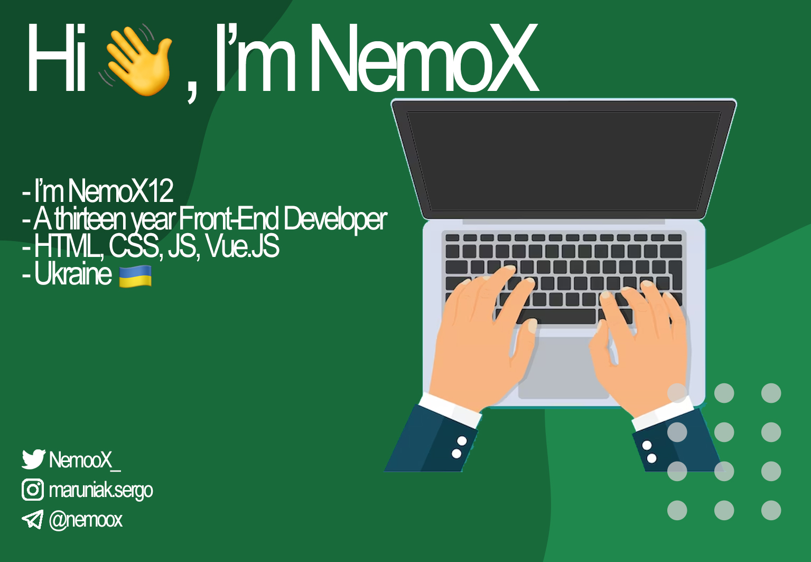

---

About Myself:

Hello, I'm Serhii.   I'm 13 Y. O.  Front-End Developer from Ukraine

Hobbies:

<ul style="font-size: 20px">
<li>Coding</li>
<li>Again coding</li>
<li>Basketball</li>
</ul>

Education:

<ul style="font-size: 20px">
<li>School №44 Named After Taras G. Schevchenko</li>
<li>IT - Self Education</li>
</ul>

---

My Skills:

Hard Skills:

Libraries & Frameworks:

Version Controls:

Extras:

OS:

---

